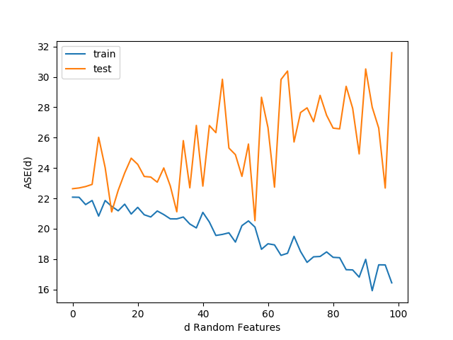

# Group Assignment 1 Linear Reg. and Logistic Reg. with Regularization

## Dependencies

- `pip install --upgrade numpy`

- `pip install --upgrade scipy`

- `pip install --upgrade matplotlib`

If you run into issues installing these on flip then add --user to install as user.

# Invocation

- `python prob1.py`
- `python prob2.py`

See 1_4_Report.png and LambdaReport.png
# Report

